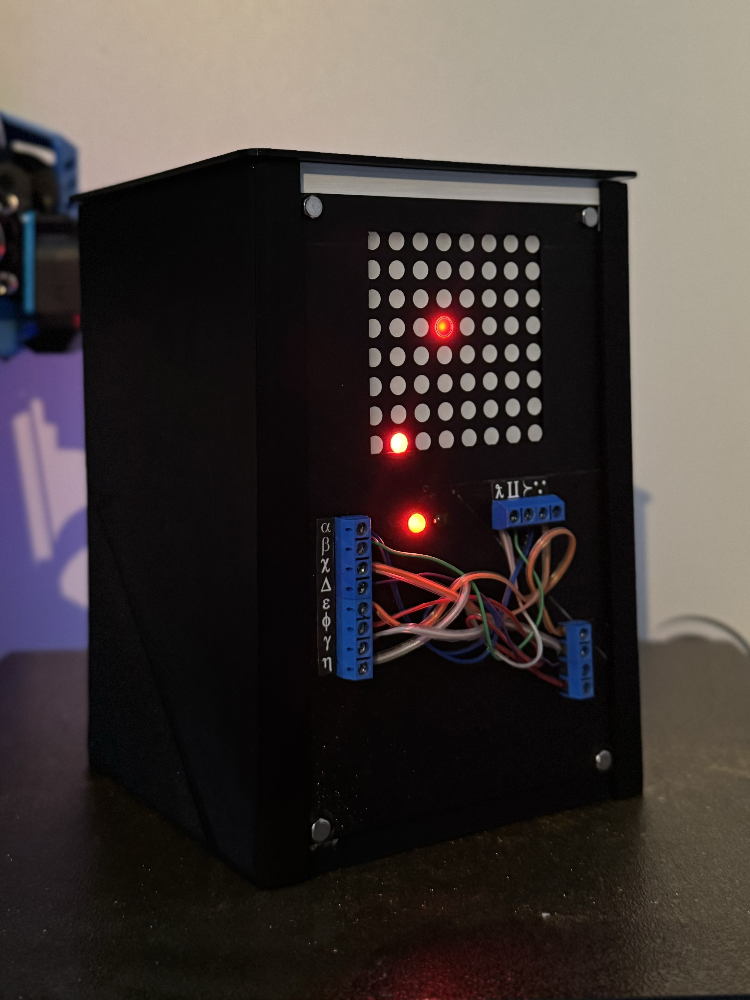

# Wibbly-Wobbly-Timey-Wimey

  
  
   
  <i>The TARDIS that need to be defused.</i>

 

"Wibbly-Wobbly Timey-Wimey" is a bomb defusal escape game inspired by the popular television series <a href="https://fr.wikipedia.org/wiki/Doctor_Who" target="_blank">Doctor Who</a>. This game draws inspiration from the mechanics of <a href="https://keeptalkinggame.com/" target="_blank">Keep Talking And Nobody Explodes</a>. The primary objective of our game is to defuse the TARDIS by solving four small puzzles within a 45-minute time limit. To assist players in resolving these puzzles, the game includes a documentation guide.

## The project

This project is an engineering school assignment completed over one semester in groups of three. The instructions for this project were to create something playable, drawing inspiration from a movie or a series. Given my strong interest in escape games, the idea of developing a game similar to <a href="https://keeptalkinggame.com/" target="_blank">KTaNE</a> quickly crossed my mind. The challenge, however, was to connect this concept with a movie. Fortunately, one member of our group was a passionate fan of Doctor Who, and that's when the project truly took off!

## How to play

The game is designed to be played by two players: one manipulating the bomb, and the other reading the manual. Both players can see the bomb and the manual. If you want to increase the difficulty, you can play separately, with one person handling the bomb and the other reading the manual.

## The defuse manual

The manual and page layout were entirely created by my two friends. I'm not really proficient with Word and Doctor Who... Here is the manual:

- [Wibbly-Wobbly Timey-Wimey Manual.pdf](Wibbly-Wobbly_Timey-Wimey_Manual.pdf)

# Puzzle description and working principle

  
   
  <i>Schematic of the TARDIS.</i>

The game is composed of 4 defusable puzzles that need to be defused to win the game. Each puzzle is independent of the others, and every solution is in the manual.

  

  
  
  
   
  <i>The electronic components of the TARDIS.</i>

 

This project uses an Arduino MEGA as the main microcontroller. Each module consists of a custom-made electronic circuit soldered onto perfboard. The entire system is powered by four lithium-ion 18650 batteries arranged in series, allowing the project to run continuously for 45 minutes.

## The Timer

    <video style="border-radius: 5px; max-height: 300px;" autoplay muted loop controls>
    <source src="_img/timer.mp4" type="video/mp4">
    </video>

The timer module is a simple 4-digit 7-segment display that indicates the remaining time of the game.

## The Joystick

    <video style="border-radius: 5px; max-height: 300px;" autoplay muted loop controls>
    <source src="_img/joystick.mp4" type="video/mp4">
    </video>

The joystick puzzle consists of a joystick and a 16-LED ring that displays a binary code. Based on the code shown by the ring, the user needs to identify the correct directional sequence in the manual and replicate it on the joystick to solve and unlock the puzzle.

## The LCD

    <video style="border-radius: 5px; max-height: 300px;" autoplay muted loop controls>
    <source src="_img/lcd.mp4" type="video/mp4">
    </video>

The LCD puzzle consists of an LCD screen and four buttons. Two symbols and a group of letters are displayed on the LCD. The user needs to decipher the word based on the two symbols, using the manual to unlock this puzzle.

## Wires

  
   

To unlock this puzzle, you need to cut the correct combination of wires, as indicated in the manual. Be careful, as cutting a wire that was not meant to be cut will lock the puzzle forever! :D 

## The Gyroscope

    <video style="border-radius: 5px; max-height: 300px;" autoplay muted loop controls>
    <source src="_img/gyro.mp4" type="video/mp4">
    </video>

The gyroscope module is pretty easy to defuse. You need to rotate the TARDIS to move a dot on the LED matrix. This dot needs to be placed on the other static dot to validate a step. You will need to do this 5 times to defuse this module.

# 3D Project

    <video style="border-radius: 5px; max-height: 300px;" autoplay muted loop controls>
    <source src="_img/3D_project_build.mp4" type="video/mp4">
    </video>

The structure of the project is entirely 3D printed using a Sidewinder X1 and a Wanhao D12. One of the instructions for this project was that it needed to be demountable, so we couldn't use glue to attach components or anything (I really don't like glue anyway, ahah!).

## The base

  
   
  <i>3D model of the TARDIS base structure.</i>

 

The main structure of the TARDIS consists of two identical bases held together by four metal rods cut to size and press-fitted inside four holes in those bases. This structure is exceptionally strong and can support my weight (70 kg) in compression, and likely even more.

## Each faces

  
   
  <i>3D model of the TARDIS front face.</i>
   
   
  
   
  <i>3D model of the back TARDIS back face.</i>

 

Every module is distributed on the front and back surfaces of the TARDIS. Designing these surfaces was a nightmare, as each module had to fit into a very tight space. Additionally, we had to incorporate our clipping mechanism to ensure that everything securely holds onto these surfaces.

## Clipping method

Since glue was forbidden, I had to come up with an idea to secure every custom-made perfboard to the front and back faces. The initial concept involved creating small chamfers to insert the perfboard and secure it in place using clips. This method worked quite well for a single attachment, but after removing the board, the chamfers tended to wear out, rendering them ineffective for subsequent uses.

 

  
   
  <i>The abandonned clipping method. </i>

I didn't like the idea of reprinting a 6-hour-long piece just because one clip is worn. So I came up with another idea. Each board is held in place by small 3D printed pieces that fit into notches.

  
   
  <i>The really good (clever? 🫣) clipping method. </i>

Here is one of those pieces that is heated to become deformable, allowing us to install it inside those notches. Once installed, we let these pieces cool down and regain their stiffness. And TADAAAA! In the event that we need to remove a module, we can cut these small pieces with a cutting plier. If we want to reinstall the module, one piece takes up to three minutes to print (Wayyyy better than 6 hours), making it possible to reinstall the module.

# Conclusion

This project is by far the most advanced I have undertaken so far. I truly enjoyed imagining puzzles and bringing them to life using electronics and code. Additionally, we received a really good grade for this project! :D

# Licence
- romainflcht